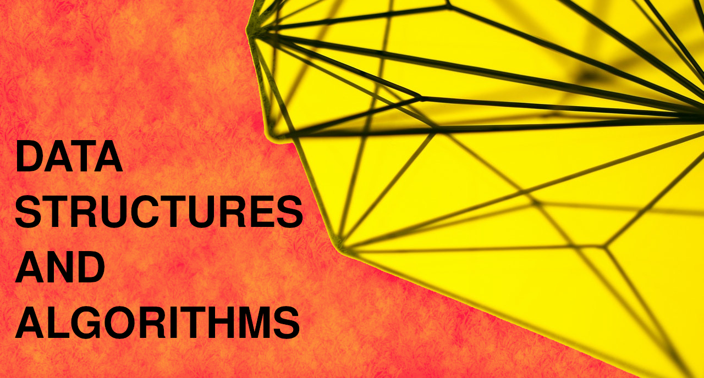

# Data Structure and Algorithm using C++

If you find it helpful, hit that ⭐ button.

# [Mastering Data Structures & Algorithms using C and C++](https://www.udemy.com/course/datastructurescncpp/)

Learn, Analyse and Implement Data Structure using C and C++. Learn Recursion and Sorting.

4.7 ⭐ (18,330 ratings) 65,135 students

Created by [Abdul Bari](https://www.udemy.com/user/mohammed-abdul-bari-2/)

## Overview

* Learn various Popular Data Structures and their Algorithms
* Develop your Analytical skills on Data Structure and use then efficiently.
* Learn Recursive Algorithms on Data Structures
* Learn about various Sorting Algorithms
* Implementation of Data Structures using C and C++

## Contents

- [Recursion]()
- [Arrays Representations]()
- [Array ADT]()
- [Strings]()
- [Matrices]()
- [Sparse Matrix and Polynomial Representation]()
- [Linked List]()
- [Sparse Matrix and Polynomial using Linked List]()
- [Stack]()
- [Queues]()
- [Trees]()
- [Binary Search Trees]()
- [AVL Trees]()
- [Search Trees]()
- [Heap]()
- [Sorting Techniques]()
- [Hashhing Technique]()
- [Graphs]()
- [Asymtotic Notations]()

## Credits

- **Special thanks** to [Abdul Bari](https://www.udemy.com/user/mohammed-abdul-bari-2/) Sir for providing this intuitive course.
- A huge thanks to the [Udemy](www.udemy.com) for providing a great platform to learn. 
